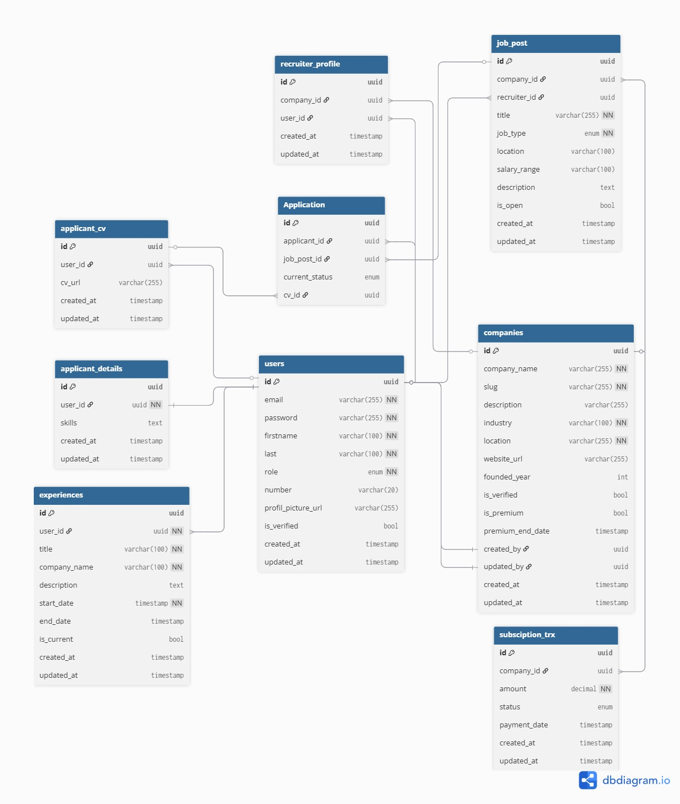

# Hiring Platform API (NestJS + TypeScript)

## Overview
Project ini dibuat untuk memenuhi technical test **PT. Digdaya Olah Teknologi (DOT) Indonesia** — posisi **Backend Developer**. Tema yang dipilih adalah Hiring Platform API


---

## 🧱 Tech Stack
- **Language:** TypeScript  
- **Framework:** NestJS  
- **ORM:** TypeORM  
- **Database:** PostgreSQL  
- **External API Integration:** Midtrans (Payment Gateway)
- **Auth:** JWT Authentication + Role-based Authorization  
- **Logging:** Winston (file-based)  
- **Error Handling:** Global Exception Filter  
- **Cloud Service:** Supabase (for file upload)  

---

## 📂 Folder Structure
src/ <br>
├── common/ <br>
│ ├── enums/ <br>
│ ├── filters/<br>
│ ├── guards/<br>
│ ├── interfaces/<br>
│ ├── pipes/<br>
│ ├── utils/<br>
│ └── config/<br>
├── modules/<br>
│ ├── auth/<br>
│ ├── users/<br>
│ ├── companies/<br>
│ ├── job-posts/<br>
│ ├── job-application/<br>
│ ├── experiences/<br>
│ ├── premium_transactions/<br>
│ ├── upload/<br>
│ └── supabase/<br>
├── main.ts<br>
├── app.module.ts<br>


---

## Features

### Authentication & Authorization
- JWT-based login & role-based access
- Guards ensure only authorized users can access resources  
- Roles:  
  - `applicant` → apply jobs, manage CV  
  - `recruiter` → create jobs, create companies

---

### 🏢 Database Design
- 9 relational tables

- `users`, `companies`, `cv`, `skills`, `recruiter_detail`, `transaction`, `job_posts`, `job_applications`, `experiences`
---

### Payment Integration
- Integrated with **Midtrans API** for premium recruiter subscriptions
- Automatic transaction saving and status update via webhook

---

###  Logging
- Implemented using **Winston**
- Logs saved in `/logs/app.log`  
- Includes context-based logs for each controller and service

---

###  Error Handling
- Global Exception Filter (`http-exception.filter.ts`)
- Handles `HttpException` and unknown errors gracefully
- Logs all error details with stack traces

---

### ☁️ File Upload
- File uploads handled via **Supabase Storage**
- Used for applicant CV or other media files

---

## Transactional Operations
Two main use cases include transactions between multiple tables:
1. **Create Company** → create company & updating recruiter detail information atomically  
2. **Payment Processing (Midtrans)** → updates transaction + company premium status  

---

## API Documentation
API endpoints documented via **POSTMAN**:
https://documenter.getpostman.com/view/25930415/2sB3WsPzqZ

---

## 🧰 Environment Variables
```env
PORT=
DB_HOST=
DB_PORT=
DB_USERNAME=
DB_PASSWORD=
DB_NAME=
JWT_SECRET=
SUPABASE_URL=
SUPABASE_KEY=
SUPABASE_BUCKET_NAME=
MIDTRANS_SERVER_KEY=
MIDTRANS_CLIENT_KEY=
MIDTRANS_MERCHANT_ID=
